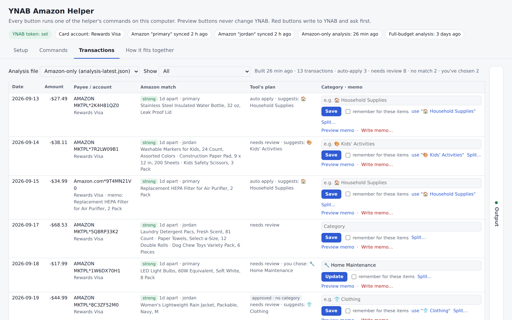
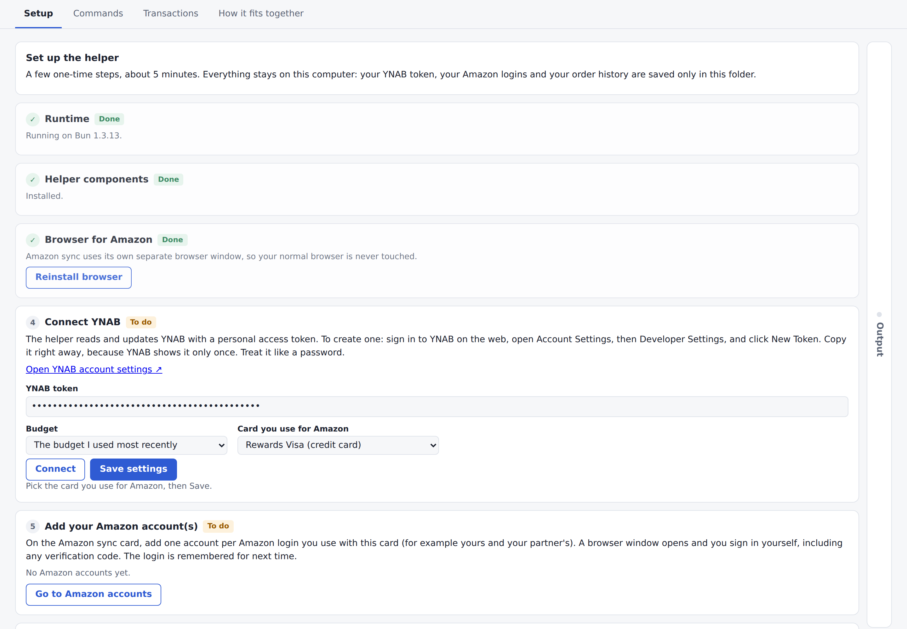
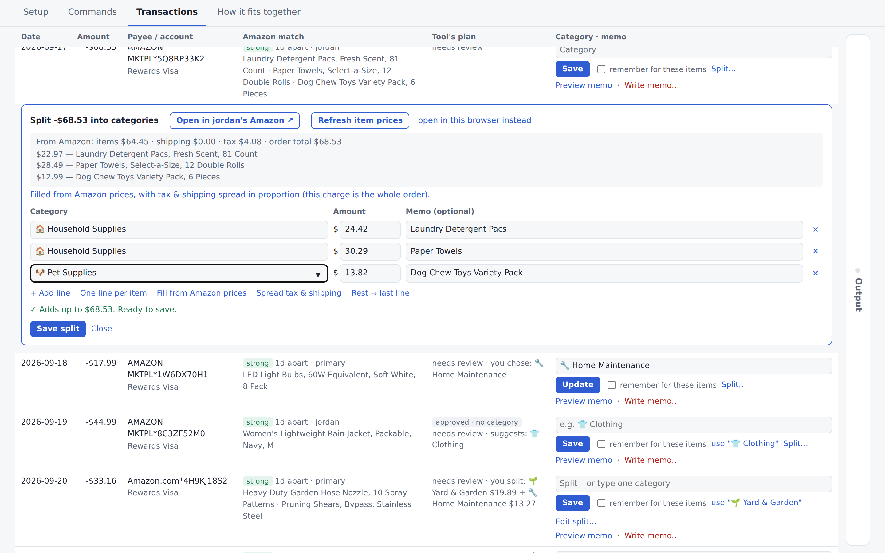

# YNAB Amazon Helper

A point-and-click helper that matches your Amazon orders to your YNAB transactions. It lets you add memos showing what you actually bought, pick categories, and split multi-item charges, all from a simple page in your browser. There's no command line to learn: double-click the launcher and it walks you through setup.

This is a fork of [deshazer/ynab-amazon-helper](https://github.com/deshazer/ynab-amazon-helper) (MIT License). It adds a local GUI, guided setup, memo-only updates, multiple Amazon accounts, split transactions, and item prices from Amazon order pages.

## What It Does

Amazon charges in YNAB usually show only "Amazon" and an amount, which makes them hard to categorize. This helper does the tedious part for you, on your own computer:

- Finds the YNAB transactions that need attention: unapproved ones, plus approved ones that still have no category
- Reads your recent Amazon orders, including item names and prices, from one or more Amazon accounts
- Matches each charge to its Amazon order, including refunds and orders Amazon charged in several parts
- Suggests categories based on how you've categorized similar purchases before
- Writes short memos with the item names, so you can see what each charge was
- Splits a multi-item charge across categories, filling in the item prices and spreading tax and shipping for you
- Skips transfers between your accounts and tracking accounts, since those don't use categories
- Previews every change and asks before writing anything to YNAB

## Who This Is For

Anyone who:

- Uses YNAB
- Buys a lot on Amazon with a shared card, possibly from more than one Amazon account
- Wants a safer option than giving a third-party service their Amazon password
- Wants to categorize Amazon purchases faster while staying in control of every change

## Getting Started

**Windows:** Download or clone this repository, unzip it somewhere simple (for example `C:\YNAB Amazon Helper`), and double-click **Start GUI.bat**.

**Mac:** Double-click **start-gui.command**. The first time, right-click it and choose Open if macOS warns you about it. The Mac launcher has had less testing than the Windows one.

On first run, the launcher offers to install [Bun](https://bun.sh), the free program that runs the helper, and then downloads the components it needs. The helper then opens in your browser on the **Setup** tab, which walks you through:

1. **Installing the browser for Amazon.** One click. The helper uses its own separate browser window, so your normal browser is never touched.
2. **Connecting YNAB.** Create a personal access token in YNAB (web app → Account Settings → Developer Settings → New Token), paste it in, then pick your budget and the card you use for Amazon.
3. **Adding your Amazon account(s).** Add one for each Amazon login that uses this card. A browser window opens and you sign in yourself, including any verification code. The login is remembered for next time.

Leave the launcher window open while you use the helper. Close it to stop.

## Day to Day

1. **Sync.** On the Commands tab, click **Sync all accounts** with "Run Analyze afterwards" turned on. This pulls your latest Amazon orders and the YNAB transactions that need attention.
2. **Review.** On the Transactions tab, you can do any of these for each charge:
   - **Write a memo** with the item names. Preview it first, then write it.
   - **Pick a category** and save it. Tick "remember" to reuse that category for the same items in future orders.
   - **Split** the charge across several categories. The helper fills in Amazon's item prices when it can find them.
3. **Send.** Click **Send to YNAB** in the bar pinned to the bottom of the Transactions tab. It shows how many choices are waiting, lets you preview them, and sends only the choices you made.

Saving a category or split on the Transactions tab only records it on your computer. Nothing changes in YNAB until you click Send to YNAB. Every button that writes to YNAB shows a preview first and asks for confirmation.

## Use It From Your Phone

The helper runs on your computer, but you can use it from your phone's browser while that computer is on:

1. On the **Setup** tab, click **Turn on phone access**. The first time, Windows may ask whether Bun can use the network. Choose **Private networks** and click Allow.
2. Scan the QR code with your phone's camera. Your phone needs to be on the same home Wi-Fi.
3. Optionally, add the page to your home screen so it opens like an app.

On a phone, transactions show as cards, and the Send to YNAB bar stays at the bottom. Amazon sign-ins and security checks still happen on the computer. Phone access is off until you turn it on, and the phone link has its own private key, which you can replace at any time. Only turn it on at home, not on public Wi-Fi. To use it away from home, connect your phone and computer with a private VPN such as [Tailscale](https://tailscale.com).

## Privacy and Safety

Everything runs locally:

- **You sign in to Amazon yourself** in a separate browser window. The helper never sees or stores your Amazon password.
- **Amazon logins stay in this folder.** They're saved in `profiles/`.
- **Your order history and analysis stay in this folder.** They're saved in `data/`.
- **Your YNAB token stays in this folder.** It's saved in `.env`.
- **Nothing is sent anywhere except YNAB and Amazon themselves.**
- **Nothing changes in YNAB until you confirm a write.**

Keep `.env`, `data/` and `profiles/` private. Git already ignores them, so they won't be uploaded if you contribute changes. Avoid keeping the folder in a synced or shared drive if you'd rather those files stay on one computer.

## Good to Know

- **Item prices are best-effort.** Amazon changes its pages from time to time. If prices can't be read, the helper tells you and you can type the amounts yourself.
- **YNAB can't edit an existing split through its API.** The helper can turn an unsplit transaction into a split. To change a split that already exists, edit it in YNAB.
- **The command-line tools and AI-assistant workflow from the original project still work.** See the [original repository](https://github.com/deshazer/ynab-amazon-helper) for those instructions.

## Credits

- **Original project:** [deshazer/ynab-amazon-helper](https://github.com/deshazer/ynab-amazon-helper), which does the Amazon order syncing, matching and YNAB integration this fork builds on.
- **This fork's GUI and additions** (guided setup, memo-only updates, multiple Amazon accounts, splits, item prices and phone access) were built with help from [Claude](https://www.anthropic.com/claude), Anthropic's AI assistant. I tested each change and reviewed it before committing.
- **QR codes** are generated with Project Nayuki's [QR Code generator library](https://www.nayuki.io/page/qr-code-generator-library) (MIT License).

## License

MIT License. See `LICENSE`. You can use, modify and share this project as long as the license notice is kept. Original project by [deshazer](https://github.com/deshazer/ynab-amazon-helper).
